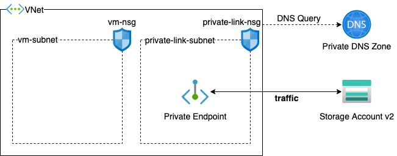

# ARM Template to Azure Private Link

## Prerequisites

- Please check this article to understand how Azure Private Link works: [What is Azure Private Link](https://docs.microsoft.com/en-us/azure/private-link/private-link-overview)

## What Azure Resources were Deployed with This ARM Template

- A Virtual Network with 2 Subnets
    - one subnet to deploy Azure Private Link,
    - the other subnet was left empty
- A Azure DNS Private Zone
    - this DNS Private Zone will be link to VNet for name resolution
- A Azure Storage Account
- A Azure Private Endpoint to refer Storage Account

## Architecture Diagram

## Deploy

## Parameters

- `vmNSGName`: name of Network Security Group to provision, and it will attach on subnet created for VMs.
- `privateLinkNSGName`: name of Network Security Group to provision, and it will attach on subnet created for Private Link.
- `vnetName`: name of Virtual Network to create.
- `vnetAddressSpace`: address spacing of Virtual Network (e.g., `192.168.100.0/24`)
- `vmSubnetName`: name of subnet in Virtual Network to provision VMs.
- `vmSubnetAddressPrefix`: address prefix for subnet to provision VMs (e.g., `192.168.1.0/24`)
- `privateLinkSubnetName`: name of usbnet in Virtual Network to provision Azure Private Link.
- `privateLinkSubnetAddressPrefix`: address prefix for subnet to provision Azure Private Link (e.g., `192.168.2.0/24`)
- `storageAccountName`: name of Azure Storage Account to deploy.
- `privateDNSZoneName`: name of Private DNS Zone (e.g., privatelink.blob.core.windows.net)
- `privateEndpointName`: name of Private Endpoint.
